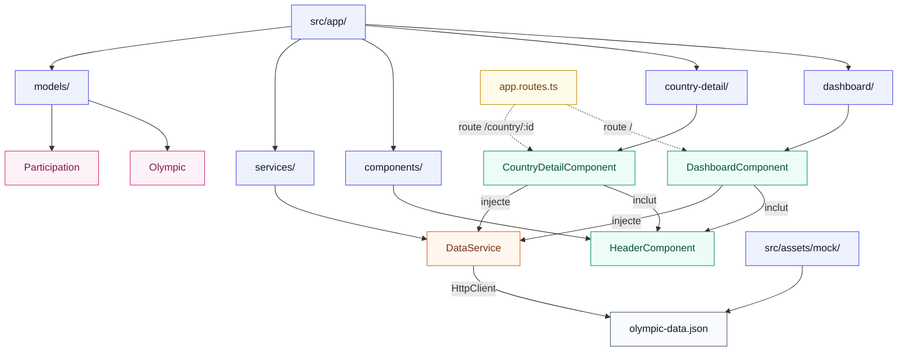

# Notes d'architecture

| Categorie | Zone | Point verifie | Resultat | Probleme identifie | Commentaire personnel | Priorite |
| --- | --- | --- | --- | --- | --- | --- |
| Application | build | ng serve | ✅ | - | l'application build et démarre correctement | ❌
| Application | test | ng test | ❌ | un première test ne passe pas car une propriété du composant AppComponent n'existe pas | Même en corrigeant il y a un problème pour exécuter les tests | ⬇️
| Application | lint | ng lint | ❌ | le linter n'est pas installé | Il pourrait déjà permettre d'identifier des anomalies potentielles. Il y a déjà un certain nombre d'erreurs qui doivent être corrigées. A mon avis elles doivent être corrigées une fois la migration vers des composents standalone effectuée. | ⬆️
| Architecture | Composant | @NgModules | ❌ | Ce n'est plus l'architecture recommandée | Il faudra profiter du refactoring pour passer en architecture composant Standalone. Cela facilitera grandement des migrations vers des version plus récentes d'Angular. | ⬆️
| Données | assets | code | ✅ | Présence du fichier JSON servant de base de données dans un sous-dossier d'assets accessible publiquement | Les données ne doivent pas être accessibles directement. Finalement c'est ok, l'accès doit simuler l'accès publique à une API via HTTP. On conserve ce fichier dans ce dossier | ✅
| Données | Modèles | spécifications | ❌ | les spécifications concernants les types de données ne sont pas respectées. Cela entraîne une utilisation trop important de typage laxiste 'any'. Cela ne tient pas compte des contraintes non fonctionnelles des spécifications | Il faut donc implementer les interface de typage réprésentant les données | ➡️
| Données | Service | spécifications | ❌ | Aucun service implémenté contrairement aux spécifications. L'accès aux données se fait directement dans les composents | Implémenter le service et éviter les appels HTTP direct dans les composents. Centraliser dans le service | ⬆️ |
| Layout | Header | Spécifications | ❌ | Le composent n'existe pas. Comme il n'existe pas il n'est pas appliqué sur l'ensemble des pages CountryDetailPage et NotFound. Cela entraîne une incohérence entre les pages | Créer le composent l'appliquer sur l'ensemble des pages | ⬆️
| Layout | Header | spécifications | ❌ | Selon moi il manque un lien sur le titre de l'application pour faciliter le retour à la page d'accueil | A rectifier | ➡️
| Layout | Header | spécifications | ❌ | Le header est dupliqué et ne respecte pas les spécifications. Il doit être réutilisable et paramétrable pour l'utiliser sur les différentes pages | Se conformer aux spécfications | ⬆️
| Attente |  | spécifications + code | ❌ | Aucune gestion d'un délai d'attente sur l'accès aux données | Il faut que l'utilisateur soit conscient qu'un traitement est en cours pour le faire patienter | ➡️
| Qualité |  | spécifications + code | ❌ | Il existe des console.log() dont un qui afficher la toalité des données récupérées. Celui pour l'affichage d'une erreur de récupération des données est utile pour le debug mais devrait être simplifié pour l'affichage à l'utilisateur | A supprimer | ⬆️
| Gestion d'erreur |  | spécifications + code | ❌ | aucun affichage d'erreur explicite en cas de problème d'accès aux données ou de données vide | Afficher les erreurs utile à l'utilisateur | ⬆️
| Routing | Page not found | code | ❌ | Path pour cette route inutile | A supprimer | ⬇️
| Routing | country | code | ❌ | Nom du pays pour accéder à la page de détail d'un pays. Utilisation de subscribe pour récupére le nom du pays dans l'URL dans le composent de détails du pays. | Utiliser ActivedRoute pour simplifer le passage de paramètre dans l'URL et utiliser plutôt l'id du pays | ⬆️
| Composent |  | code | ❌ | Les graphes sont construits dnas les composents | Factorisation de la construction des graphes dans les composents | ➡️
| Styles |  | code | ❌ | Styles parfois trop globaux en partie lié au fait qu'il n'y ait pas de composent Header | A mieux découper en fonction des composents. Améliorer l'aspect général du rendu de l'app | ➡️
| Styles | Responsive | spécifications + code | ❌ | Le responsive n'est pas totalement respecté | Respecter les  |
| A11y |  | spécifications + code | ❌ | il n'y a pas d'icone ou bouton donc pas d'accessibilié à gérer. | Par contre, il y a sans doute de l'accessilibité à gérer pour le canvas nécessaire à l'affichage des graphes. S'informer sur ce qu'il est possible de faire dans Chart.js pour mieux gérer l'accessibilité aux quatiers de camembert par exemple sur dashboard | ➡️
| Documentation | README.md | fichier | ❌ | La documentation de démarrage du projet me parait un peu légère : pas de pré-requis, manque de précision sur la manière de démarrer le projet | A améliorer | ⬇️

## Arborescence proposée



```text
src/
├── app/
│   ├── components/
│   │   └── header/
│   │       └── header.component.ts
│   ├── country-detail/
│   │   └── country-detail.component.ts
│   ├── dashboard/
│   │   └── dashboard.component.ts
│   ├── models/
│   │   ├── olympic.ts
│   │   └── participation.ts
│   ├── services/
│   │   └── data.service.ts
│   └── app.routes.ts
└── assets/
    └── mock/
        └── olympic-data.json
```

Le fichier JSON reste placé dans `src/assets/mock/` afin de simuler une source de données externe. Son accès reste centralisé dans `DataService` via `HttpClient`, ce qui permettra de remplacer plus facilement ce mock par une vraie API backend par la suite.


